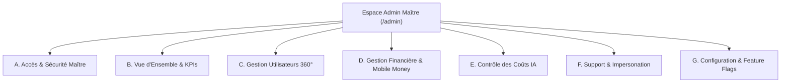

<USER_REQUEST>
okay je suis entrain d'améliorer Iris et de mettre sur pied chaque fonctionnalité pour que BoomBooks soit enfin utilisables par des millions de personnes voici ou on en est et tout ce que je dois faire : # 🚀 Iris — Feuille de Route Technique & Backlog Master (Passage à l'Échelle)

> **Document de Référence Technique & Cahier des Charges**  
> **Produit** : Iris (par Boom)  
> **Compte Administrateur Maître** : `www.martau@gmail.com`  
> **Dépôt GitHub** : `https://github.com/LucTims/Iris.git`  
> **Dernière mise à jour** : 29 juillet 2026

---

## 📌 Sommaire
1. [État des Lieux & Accomplissements Récents](#1-état-des-lieux--accomplissements-récents)
2. [Backlog Master — Organisé par Domaine (01 à 12)](#2-backlog-master--organisé-par-domaine-01-à-12)
   - [01. Correctifs critiques](#01-correctifs-critiques)
   - [02. Sécurité & contrôle des coûts IA](#02-sécurité--contrôle-des-coûts-ia)
   - [03. Données & infrastructure](#03-données--infrastructure)
   - [04. Éditeur & expérience d'écriture](#04-éditeur--expérience-décriture)
   - [05. Co-auteur IA](#05-co-auteur-ia)
   - [06. Couverture & export](#06-couverture--export)
   - [07. Facturation & paiement](#07-facturation--paiement)
   - [08. Observabilité & ops](#08-observabilité--ops)
   - [09. Accessibilité, i18n, mobile](#09-accessibilité-i18n-mobile)
   - [10. Conformité & légal](#10-conformité--légal)
   - [11. Croissance produit](#11-croissance-produit)
   - [12. Section Admin — Spécification complète](#12-section-admin--spécification-complète)
3. [Plan d'Exécution & Priorités](#3-plan-dexécution--priorités)

---

## 1. État des Lieux & Accomplissements Récents

### ✅ Fonctionnalités déjà intégrées et déployées en production :
- **Authentification & Rôles (Supabase Auth)** :
  - Inscription, Connexion, Magic Link et Google OAuth opérationnels.
  - Middleware Next.js protégeant `/dashboard`, `/projects`, `/redaction`, `/admin`, `/api/*`.
  - Whitelist Administrateur Maître pour `www.martau@gmail.com` (Rôle Admin automatique).
- **Projets & Sauvegarde en Base (CRUD & Autosave)** :
  - Table `projects` et `chapters` Supabase branchées.
  - Chargement dynamique des chapitres réels depuis `GET /api/projects/[id]`.
  - Autosave temporisé (1,5s debounced) avec statut d'enregistrement honnête (Passage à `saved` uniquement sur succès serveur HTTP 200).
- **Sécurité Server-Side des Modèles IA & Quotas** :
  - Validation du plan côté serveur dans `/api/chat` et `/api/generate-plan`.
  - Whitelist serveur des modèles (redirection des comptes gratuits tentant d'utiliser `Gemini 2.5 Pro` vers `Gemini 2.5 Flash`).
  - Quota automatique (50 générations max pour les comptes gratuits, blocage 429).
- **Studio de Couverture HD & Exportation** :
  - Générateur Canvas 2D pour couvertures PNG haute résolution (1600x2400 px).
  - Exportation PDF (Layout livre d'impression A5/A4), Word `.doc` et `.epub.html`.
- **Branding & Déconnexion** :
  - Unification de la marque **Boom** (entreprise) et **Iris** (produit).
  - Fonction `signOut()` intégrée sur l'ensemble des menus profil.

---

## 2. Backlog Master — Organisé par Domaine (01 à 12)

---

### 01. Correctifs Critiques (Priorité 0)
- [x] **Recharger les chapitres réels à l'ouverture d'un projet** : Appeler `GET /api/projects/[id]` dans `redaction/page.tsx`. *(Terminé)*
- [x] **Corriger l'ID de chapitre après création** : Utiliser l'UUID réel renvoyé par Supabase au lieu d'un entier statique `1`. *(Terminé)*
- [x] **Badge « Enregistré » honnête** : Ne passer à `saved` que si la requête API a réellement réussi. *(Terminé)*
- [ ] **Adapter `/projects` aux champs réels du schéma** : Nettoyer `book.image` / `progress` / `words` non utilisés ou les calculer/stocker réellement dans Supabase. *(En cours)*
- [x] **Unifier la déconnexion partout** : Remplacer les liens `/login` par un vrai appel à `signOut()` dans tous les menus. *(Terminé)*
- [ ] **Persister la couverture générée** : Écrire réellement la colonne `cover_url` dans la table `projects` quand l'auteur clique sur *« Appliquer au Livre »*. *(À faire)*
- [x] **Nettoyer les résidus d'un autre produit** : Suppression de *Martin Laurent* au profit de `useUser()`. *(Terminé)*

---

### 02. Sécurité & Contrôle des Coûts IA
- [x] **Liste blanche serveur des modèles IA autorisés par plan** : Empêcher un compte gratuit de forcer Gemini Pro. *(Terminé)*
- [x] **Appliquer réellement le quota IA** : Bloquer (`429 Too Many Requests`) une fois le plafond du plan atteint. *(Terminé)*
- [ ] **Limite de débit (Rate Limiting par IP et Utilisateur)** : Ajouter un middleware Redis/Upstash sur `/api/chat` et `/api/generate-plan`. *(Prioritaire)*
- [x] **Donner à l'admin un accès élargi légitime** : Route serveur et whitelist master admin pour `www.martau@gmail.com`. *(Terminé)*
- [ ] **Défense en profondeur sur les routes API** : Vérifications d'ownership explicites (`user_id = auth.uid()`) côté route en plus de RLS. *(Prioritaire)*
- [ ] **Validation et assainissement des entrées** : Sanitization contre l'injection de prompt IA et les failles XSS dans le HTML exporté. *(Prioritaire)*
- [ ] **Journal d'audit des connexions et actions sensibles** : Enregistrement des connexions admin et modifications de compte. *(Important)*

---

### 03. Données & Infrastructure (Scalabilité Millions d'Utilisateurs)
- [ ] **Index sur les colonnes de clé étrangère** :
  ```sql
  CREATE INDEX idx_chapters_project_id ON public.chapters(project_id);
  CREATE INDEX idx_projects_user_id ON public.projects(user_id);
  CREATE INDEX idx_ai_usage_user_id ON public.ai_usage(user_id);
  ```
- [ ] **Migrations versionnées Supabase CLI** : Remplacer `schema.sql` unique par des fichiers d'intégration continue versionnés (`supabase/migrations/`).
- [ ] **Sauvegardes automatiques testées** : Backups quotidiens automatisés avec script de restauration à chaud.
- [ ] **Stockage d'images dédié (Supabase Storage)** : Buckets `covers` et `manuscripts` pour remplacer l'encodage base64 dans la colonne `content`.
- [ ] **File d'attente pour les traitements longs (Async Queue)** : Utilisation de QStash / BullMQ pour l'exportation volumineuse et les générations IA lourdes afin de contourner le timeout serverless Vercel (30s).
- [ ] **Environnement de Staging & CI/CD** : Pipeline GitHub Actions exécutant `npm run build` et tests automatisés avant déploiement Vercel Production.

---

### 04. Éditeur & Expérience d'Écriture
- [ ] **Redimensionnement d'image réel** : Poignées de redimensionnement interactives dans l'éditeur Tiptap (`RichManuscriptEditor.tsx`).
- [ ] **Réorganisation des chapitres par glisser-déposer (Drag & Drop)** : Re-ordonnancement visuel des chapitres avec mise à jour du champ `number`.
- [ ] **Gestion des conflits multi-onglets/appareils** : Verrouillage optimiste basé sur `updated_at` pour éviter l'écrasement silencieux entre deux sessions ouvertes.
- [ ] **Correcteur orthographique / grammatical** : Intégration de LanguageTool API pour la correction en temps réel.
- [ ] **Compteur de mots agrégé** : Calcul dynamique du nombre total de mots sur l'ensemble du manuscrit (somme de tous les chapitres).
- [ ] **Mode focus plein écran** : Masquage temporaire de la sidebar et du panneau IA pour une écriture sans distraction.

---

### 05. Co-Auteur IA Étendu
- [ ] **Contexte étendu à tout le manuscrit (RAG)** : Chargement des résumés de tous les chapitres pour permettre à l'IA de se rappeler de l'intrigue globale.
- [ ] **Fiches Personnages & Univers persistantes** : Table `characters` consultée automatiquement dans le prompt système d'Iris IA.
- [ ] **Rechargement de la mémoire de conversation** : Rechargement des derniers échanges depuis `chat_messages` à l'ouverture d'un projet.
- [ ] **Actions ciblées d'un clic** : "Résumer ce chapitre", "Développer cette scène", "Vérifier le rythme narratif".

---

### 06. Couverture & Exportation Haute Qualité
- [ ] **Génération d'illustration par IA** : Connexion du bouton *« Générer une illustration »* à l'API Imagen 3 / Gemini Image Generation.
- [ ] **Moteur d'Export PDF Serveur (Puppeteer / React-PDF)** : Génération côté serveur d'un fichier PDF/KDP professionnel conforme aux normes d'impression (reliure, marges, fonds perdus).
- [ ] **Exportation DOCX OOXML Native** : Fichier `.docx` réel généré via la librairie `docx`.
- [ ] **Exportation EPUB Valide (Zip/OPF/NCX)** : Fichier `.epub` conforme lisible sur Kindle, Kobo et Apple Books.

---

### 07. Facturation & Paiements (Zone FCFA & International)
- [ ] **Intégration Mobile Money réelle (CinetPay / Flutterwave / Paystack)** :
  - Webhooks signés (`/api/webhooks/payment`) pour valider automatiquement les paiements Orange Money, MTN MoMo et Wave.
- [ ] **Table `subscriptions` faisant autorité** :
  - Colonnes : `user_id`, `plan_name`, `status`, `current_period_end`, `provider`.
- [ ] **Paiement Carte Bancaire (Stripe)** : Pour les auteurs hors zone FCFA.
- [ ] **Gestion des échecs de paiement & factures téléchargeables** : Relances automatiques et génération de factures PDF.

---

### 08. Observabilité & Fiabilité Opérationnelle
- [ ] **Suivi d'erreurs en production (Sentry)** : Remontée automatique des exceptions JS et erreurs API.
- [ ] **Logs structurés côté serveur** : Formatage JSON pour la recherche rapide dans Logflare / Datadog.
- [ ] **Alertes de Budget & Coûts IA** : Notification automatique à l'administrateur en cas de pic de consommation Gemini.

---

### 09. Accessibilité, PWA & Mobile
- [ ] **PWA Installable & Mode Hors-Ligne** : Service Worker permettant d'écrire sans connexion internet et d'effectuer une resynchronisation au retour du réseau.
- [ ] **Compression d'images côté client** : Réduction automatique de la taille des images avant upload (économise les données mobiles des utilisateurs).
- [ ] **Conformité A11y (WCAG 2.1)** : Navigation complète au clavier et contraste de couleurs vérifié.

---

### 10. Conformité & Légal
- [ ] **Mise à jour des CGU & Politique de Confidentialité** : Alignement strict des mentions légales avec le stockage Supabase et l'usage des API IA.
- [ ] **Processus d'Export et Suppression RGPD** : Bouton dans la section `/settings` permettant de télécharger toutes ses données ou de supprimer son compte définitif.

---

### 11. Croissance Produit & Engagement
- [ ] **Emailing Transactionnel (Resend / SendGrid)** : E-mails de bienvenue, réinitialisation de mot de passe et notifications de quota.
- [ ] **Analytics Produit (PostHog / Mixpanel)** : Analyse des parcours utilisateurs pour optimiser la conversion du plan Gratuit vers Pro.

---

## 12. Section Admin — Spécification Complète

L'Espace Administrateur Maître (`/admin`), accessible exclusivement à `www.martau@gmail.com`, sera découpé en 9 modules de pilotage :



### 🔹 Module A : Accès & Sécurité Maître
- **Service Role Bypass** : Interrogation globale des données Supabase via la clé de service sécurisée serveur (contournant RLS).
- **2FA Administrateur** : Authentification à deux facteurs obligatoire pour le compte `www.martau@gmail.com`.
- **Journal d'Audit Immuable** : Historique complet de toutes les actions d'administration (date, heure, IP, action effectuée).

### 🔹 Module B : Vue d'Ensemble & KPIs de Pilotage
- **Indicateurs d'Engagements** : DAU (Utilisateurs actifs quotidiens), WAU, MAU et taux de rétention.
- **Volume d'Écriture** : Courbes du nombre de mots rédigés et de chapitres générés sur 7/30 jours.
- **Métrique Financière** : Revenu Mensuel Récurrent (MRR en FCFA), taux de conversion Gratuit ➔ Pro, Churn rate.

### 🔹 Module C : Gestion des Utilisateurs 360°
- **Recherche globale & Fiche Auteur** : Vue complète sur un utilisateur (projets créés, crédits IA consommés, statut de paiement).
- **Actions Directes** : Suspension de compte abusif, passage manuel d'un utilisateur en Plan Pro (geste commercial/support).
- **Mode Impersonation** : Possibilité de voir l'application du point de vue d'un auteur pour l'aider en cas de bogue (avec trace dans le journal d'audit).

### 🔹 Module D : Gestion Financière & Transactions
- **Journal des Transactions** : Liste en temps réel des paiements Orange Money, MTN MoMo, Wave et Carte bancaire.
- **Remboursements & Relances** : Gestion des paiements échoués et relances automatisées.
- **Export Comptable** : Téléchargement des rapports financiers en format CSV / Excel.

### 🔹 Module E : Suivi & Contrôle des Coûts IA
- **Dépense IA en temps réel** : Coût comparé Gemini 2.5 Flash vs Gemini 2.5 Pro par jour et par utilisateur.
- **Alertes de Seuil Budgétaire** : Notification avant le dépassement du budget IA mensuel.
- **Calcul de Marge Brute** : Marge nette par utilisateur abonnés par rapport à sa consommation réelle d'IA.

### 🔹 Module F : Support & Configuration
- **Système de Ticketing / Support** : Visualisation des messages d'aide envoyés par les auteurs.
- **Bannière de Maintenance / Annonce** : Activation d'un message global sur le site en 1 clic sans redéploiement de code.
- **Feature Flags** : Activation progressive des nouvelles fonctionnalités par pourcentage d'utilisateurs.

---

## 3. Plan d'Exécution & Priorités

| Étape | Focus | Objectif |
| :--- | :--- | :--- |
| **Étape 1 (Immédiate)** | Correctifs DB & Quotas | Finaliser l'indexation DB, le rate limiting IP et persister `cover_url`. |
| **Étape 2 (Sous 2 semaines)** | Monétisation FCFA | Câbler le webhook CinetPay/Flutterwave pour les vrais abonnements Mobile Money. |
| **Étape 3 (Sous 1 mois)** | Espace Admin Complété | Déployer les modules de gestion utilisateurs et analytics financiers sur `/admin`. |
| **Étape 4 (Sous 2 mois)** | Production de Livres | Moteurs d'export PDF/DOCX/EPUB natifs et PWA Hors-ligne. |

---
*Ce document sert de spécification technique officielle pour le développement de la plateforme Iris par l'équipe Boom.*

</USER_REQUEST>
<ADDITIONAL_METADATA>
The current local time is: 2026-07-29T22:44:25+01:00.
</ADDITIONAL_METADATA>
<USER_SETTINGS_CHANGE>
The user changed setting `Model Selection` from None to Gemini 3.6 Flash (High). No need to comment on this change if the user doesn't ask about it. If reporting what model you are, please use a human readable name instead of the exact string.
</USER_SETTINGS_CHANGE>